# Exxeed

A **track coach for iRacing**. It helps you learn a new track by talking you
round it while you drive.

```
"Brake at the hundred board, down to third"
"Gas when you see the ferris wheel"
"Stay inside for the next one"
```

It is a track guide, but one you learn by doing. Each callout names something
you can see from the car and is spoken just before you need it, so your first
laps at a new circuit are already guided laps.

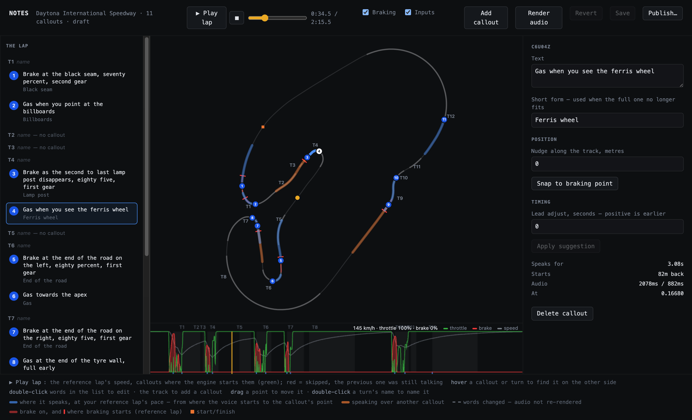

> **Status: alpha.** It runs against iRacing on Windows and is developed on a
> Mac against recorded laps. There is no installer yet; run it from source
> (see [Development](#development)).

## Learning by doing, not homework

The usual way to learn a track is a YouTube track guide. They are good, and
they are homework: you watch, pause, re-watch, then get in the car and try to
remember what was said about turn seven while you are arriving at turn seven.

Exxeed moves the guide into the car.

- **Told at the corner, not the night before.** "Brake at the 100 board" arrives
  about a second before the 100 board does.
- **Things you can see.** Boards, kerbs, the end of a tyre wall. Not "brake at
  2,340 metres".
- **You drive from the first minute.** The laps you would spend guessing are
  spent learning.
- **The same guides, turned into callouts.** A YouTube track guide can be
  imported and becomes one callout per corner, with credit to its author. Or
  install a pack another driver has already made for that track and car.

Lap-comparison tools tell you to "brake 10 metres later", which only helps once
you already know roughly where to brake. Exxeed is for the step before that.

A set of callouts for one track and car is a **callout pack**. You can write
one, import one, or install one.

## What it does

### Voice callouts while you drive

Each callout sits at a point on the lap. The app starts speaking early enough
that the sentence ends about a second before you get there.

- **Timing from a reference lap.** The app knows how long each stretch of track
  takes from a reference lap and adjusts for how fast you are going, so a callout
  starts where the editor shows it will. Without a reference lap it assumes you
  hold your current speed.
- **One voice, no talking over itself.** If two callouts collide, the app plays
  the short form of the later one, or drops it. A late braking call is worse
  than none.
- **Quiet when it should be.** Nothing is said on the out-lap, in the pits, off
  track or under tow. Overlays hide and callouts mute when iRacing is not the
  window in front (a setting).
- **No network or AI while driving.** Everything is read from disk before the
  session and the audio is pre-rendered.

### The note editor

Where a pack is written and checked (screenshot above). `Cmd/Ctrl+E` opens it.

- **The lap in order**: each turn with its callouts in a list beside the map.
  Hover either side to find it on the other.
- **Where each callout speaks**: the blue arc is the stretch of track the voice
  runs over. Orange means two callouts overlap.
- **Where the reference lap braked**: red stripes for brake on, a red bar where
  braking starts. A callout can be snapped to that point.
- **Throttle, brake and speed** for the whole lap under the map.
- **Play lap** drives the reference lap around the map at its real speed and
  speaks each callout where the app would. Edits are heard from the next lap,
  before saving.
- **Corner names**: double-click a turn to name it.
- **Render audio** speaks the text locally with Piper and shows progress per clip.

### Track Coach and shared packs

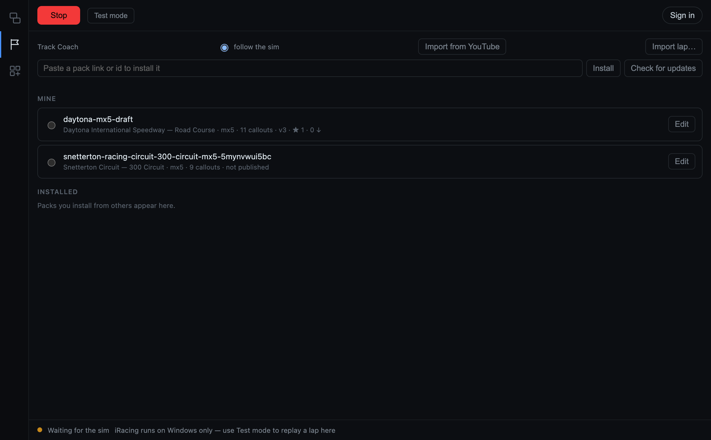

Track Coach lists the packs you wrote and the ones you installed, and picks the
right one for the track and car when the sim connects. **Test mode** replays a
recorded lap through the callouts and overlays without the sim.

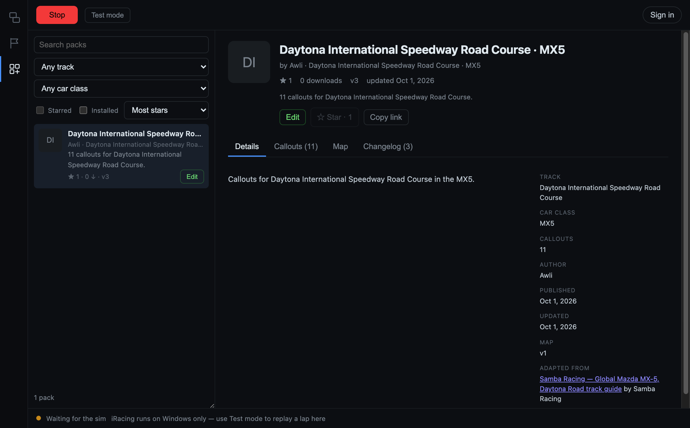

The **Content** tab is where packs are found: search, filter by track and car
class, sort by stars or downloads. Each pack has a page with its description,
screenshots, the callouts, the map and a changelog.

- Packs have **versions**. Installed packs update, and you can pin or roll back.
- **Setups and lap files** (`.sto`, `.blap`, `.olap`) can be attached to a pack;
  setups are installed into iRacing's setups folder.
- Browsing and installing need **no account**. Publishing and starring need a
  sign-in (Discord, Google or email).
- A pack is about 1 KB of text. **Audio is rendered on the machine that installs
  it**, so only the words travel.

### Import from YouTube

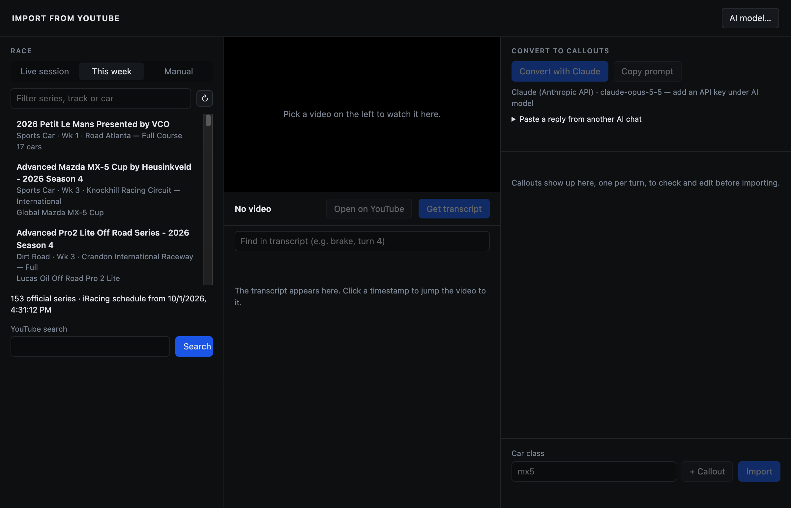

Pick this week's race, find a track guide, and turn its transcript into one
editable callout per corner with the AI model you choose, on your own API key.
The callouts are placed on the map, rendered and opened in the editor for
review, with a credit to the guide. Details under
[Importing from YouTube](#importing-from-youtube).

### Track maps from one lap

A map is cut automatically from your first clean lap at a track: the centreline
from recorded positions, the corners from the steering trace. That lap also
becomes the reference lap. Maps are shared, so the second driver at a track gets
one without driving for it.

### Garage 61

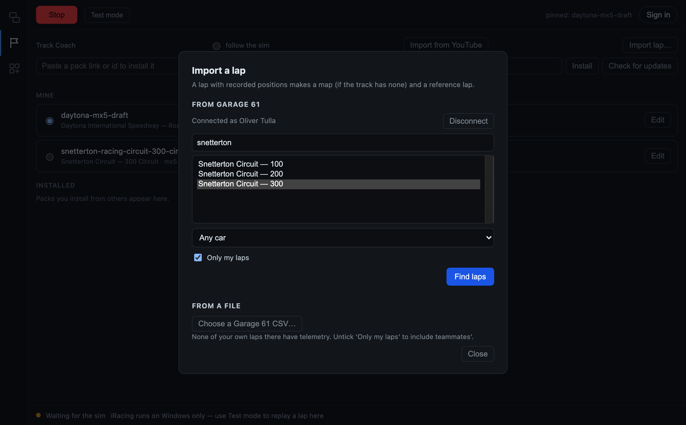

You can import a fast lap from [Garage 61](https://garage61.net) and use it as
your **reference lap**: the lap your callouts are timed against, and the one
the overlays compare your throttle, brake, speed and delta to
(**Track Coach → Import lap…**).

Connect your Garage 61 account, pick the track and car, and choose a lap. If
the track has no map in Exxeed yet, the same lap draws it. A lap exported from
Garage 61 as a CSV file works too, with no account connected.

- **Your own laps by default.** A teammate's lap is offered only if you untick
  "Only my laps", with a reminder that it is theirs to share.
- **Your Garage 61 token stays on your PC**, stored encrypted with the OS
  keychain. It is never sent to Exxeed's servers.
- **Only what is built from the lap is kept**: the reference lap and, if needed,
  the track map. When you are signed in to Exxeed these are shared, so the next
  driver at that track has a map. The Garage 61 file itself is not stored.
- Uses Garage 61's documented v1 API (driver, tracks, cars, lap search, lap
  CSV), one lap per import, and waits out rate-limit responses.

### Overlays

Transparent, click-through windows over the sim. Each one is its own window
that you drag and resize into place; layouts are saved as profiles. They are
shown only while iRacing is the window in front (a setting).

The pictures below use the app's built-in sample feed, the one it shows while
you arrange overlays, so the names and numbers are made up.

**Driving**

| Overlay | What it shows |
| --- | --- |
| 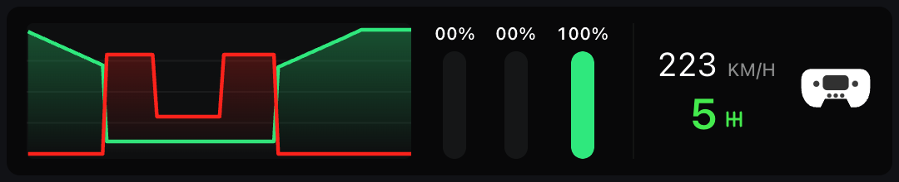<br>**Essential Inputs** | Throttle and brake as a rolling trace and as bars, with speed, gear and steering. |
| 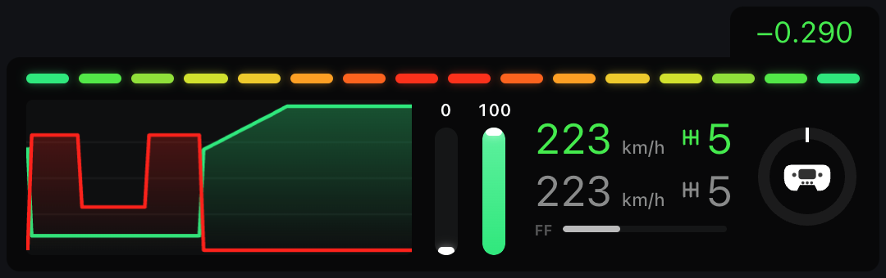<br>**Input Telemetry** | The fuller version: adds the reference lap's speed and gear under yours, the live delta and the steering angle. |
| 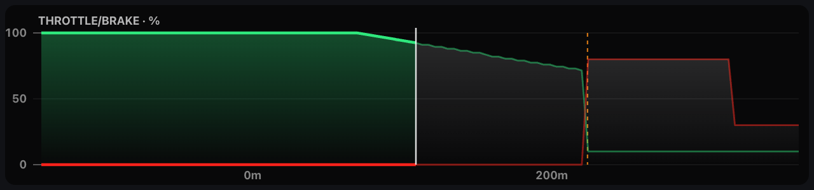<br>**Input Comparison** | Your throttle and brake against the reference lap over the track just ahead, with the reference braking point marked. |
| 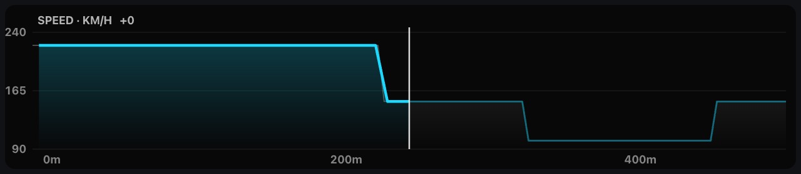<br>**Speed Comparison** | Your speed against the reference lap's over the next few hundred metres. |
| 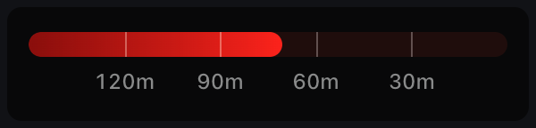<br>**Brake Indicator** | A countdown bar to the reference braking point, in metres. |

**Timing**

| Overlay | What it shows |
| --- | --- |
| 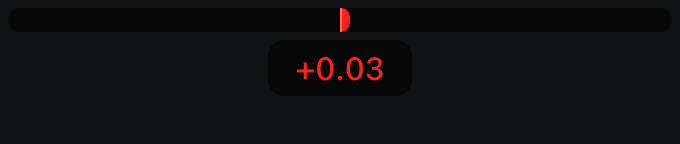<br>**Delta Bar** | Time gained or lost against the reference lap, live. |
| 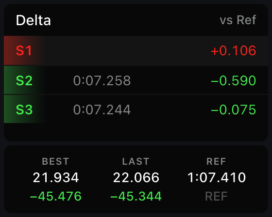<br>**Delta Sectors** | The delta per sector, with best, last and reference lap times. |
| 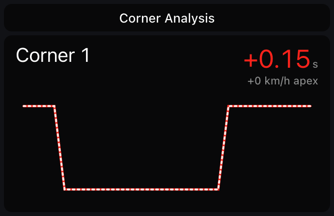<br>**Corner Analysis** | Time gained or lost in the corner just taken and the apex speed difference, with the speed trace through it. |
| 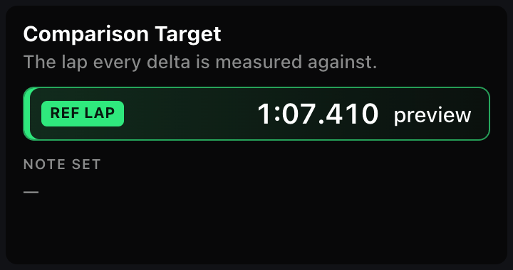<br>**Comparison Target** | Which lap every delta is measured against, and the callout pack that is loaded. |

**Race**

| Overlay | What it shows |
| --- | --- |
| 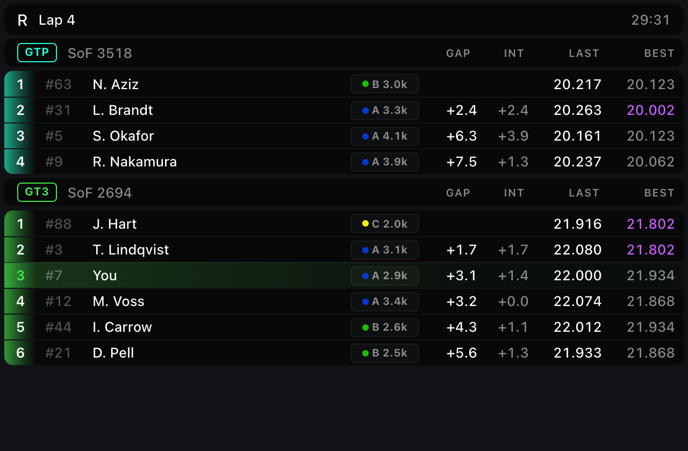<br>**Standings** | The field by class: strength of field, licence and iRating, gap, interval, last and best lap. |
| 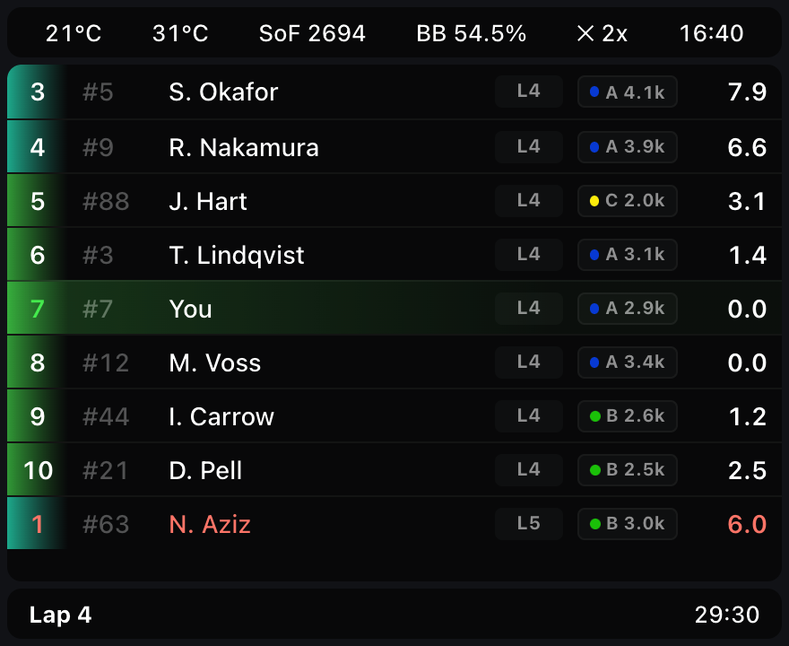<br>**Relatives** | The cars around you on track with the gap to each, plus temperatures, brake bias, incidents and time left. |
| 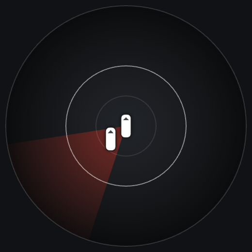<br>**Radar** | Cars alongside you, with the occupied side lit. |

**Track**

| Overlay | What it shows |
| --- | --- |
| 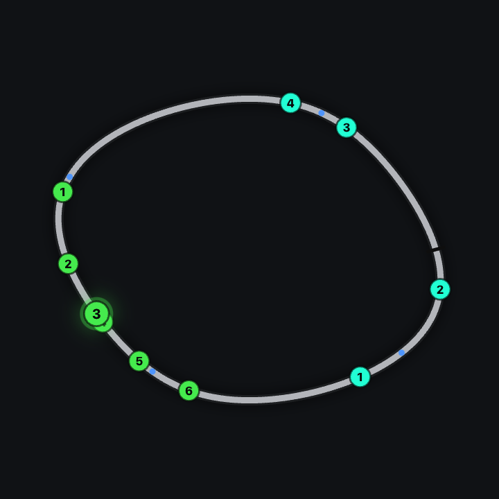<br>**Track Map** | The whole circuit with every car by class position, and where the callouts are. |
| 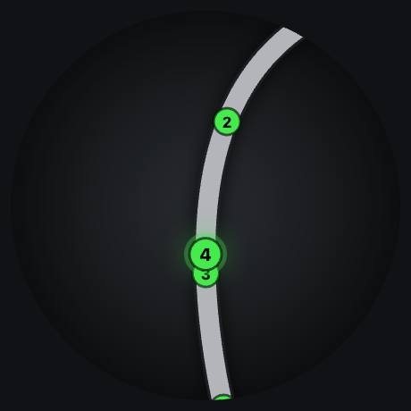<br>**Mini Map** | A zoomed view of the track around your car. |

**Car**

| Overlay | What it shows |
| --- | --- |
| 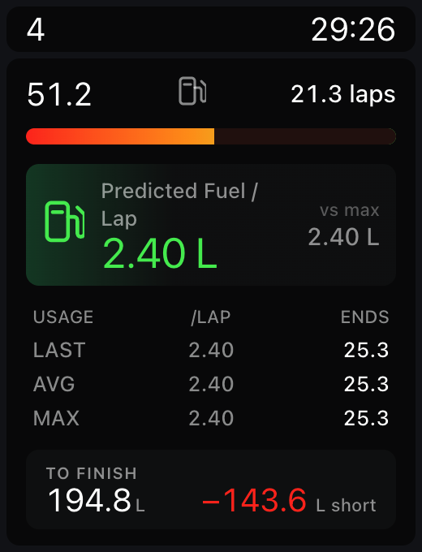<br>**Fuel Calculator** | Fuel and laps left, usage per lap (last, average, max) and how much is needed to finish. |
| 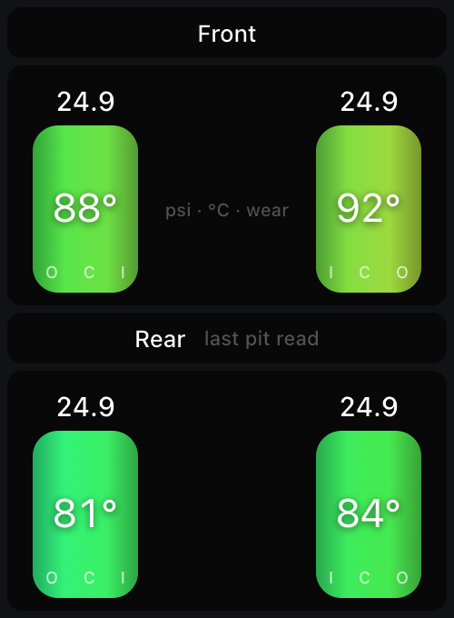<br>**Tyres** | Pressure, temperature across the tread and wear for each tyre, from the last pit read. |
| 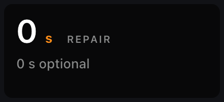<br>**Damage** | Required and optional repair time. |
| 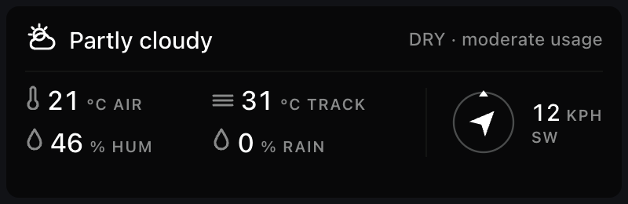<br>**Weather Conditions** | Sky, air and track temperature, humidity, rain, wind and how wet the track is. |

### Not built yet

A Windows installer, a race summary after each session, overlay themes, driver
profiles with stats, and callouts that go quiet once you have learned a corner.
`TODO.md` has the plan.

## How it's built

The system splits along a build-time / run-time line, and keeping that line sharp
is the main architectural discipline:

```
PREPARATION (offline, slow, AI in the loop)
  one lap        ──► track map + centreline + reference lap
  YouTube video  ──► note set ──► human review ──► audio pack
                                     │
                                     ▼
RUNTIME (60 Hz, dumb, deterministic)
  telemetry + note set ──► trigger ──► speak
```

The runtime is deliberately stupid: no analysis, no model calls, no network, no
decisions that aren't already in the data. It reads pre-computed artefacts and
fires pre-rendered audio. That is what makes it fast, offline-capable, testable
off a recording, and free to run. The AI cost is paid once per video, never per
lap.

Node 20 · TypeScript (strict, everywhere) · Electron · pnpm workspaces · Vitest ·
Supabase. Local disk is what a session runs from; the cloud is a sync service
for maps and packs.

## Rendering audio

Callouts are rendered offline, once per note set, by [Piper](https://github.com/rhasspy/piper)
— local, free, and native 16-bit WAV, so nothing calls a TTS API at runtime and
there is no `ffprobe` dependency: duration is read straight out of the header.

**Only authors need any of this.** A note set carries its own audio — ten files
and about 1.2 MB for a five-callout set — so driving one someone else wrote needs
no Piper, no voice model and no setup. That is the whole reason §10 renders
offline: CrewChief needs a several-hundred-megabyte sound pack because it
assembles sentences from fragments at runtime, and Exxeed does not, because each
callout is one fixed sentence rendered whole.

To write notes, open **Preferences → Voice rendering**. It lists the voices it
can fetch, downloads the one you pick into `data/voices/`, and finds Piper
itself. On Windows and Linux it can install Piper for you; on macOS there is no
working standalone build, so use a venv:

```sh
python3 -m venv .venv && .venv/bin/pip install piper-tts
```

The same venv is what the ingest CLI uses when rendering a pack away from the sim
machine:

```powershell
# Windows
python -m venv .venv
.venv\Scripts\python.exe -m pip install piper-tts
pnpm --filter @exxeed/ingest start render daytona-mx5-draft --data data
```

A venv puts its executables in `Scripts\` on Windows and `bin/` elsewhere, and
`--piper` defaults to whichever matches the platform it is running on. Override
it with `--piper` or `EXXEED_PIPER` if piper lives somewhere else.

```sh
python3 -m venv .venv && .venv/bin/pip install piper-tts
```

`data/voices/` and `data/piper/` are gitignored, as is the venv — a voice model
is ~60 MB of someone else's weights, not source. So is `data/audio/`: **an audio
pack is a build artefact, not source.** A fresh clone has note sets but no sound,
and rendering is what produces it — if callouts are silent, or beep, that is the
step that has not been run.

### Voice licences, which are not a formality

Most Piper voices cannot be shipped in a product, and the popular ones are the
worst offenders. `en_US-lessac-medium` — the obvious default, and what this
project rendered with first — is trained on the Blizzard 2013 Lessac corpus,
whose licence forbids "the development, marketing, commercialisation, sale or
licencing of voice synthesis products", and that reaches the *synthesised audio*,
not just the model. `hfc_male` is CC BY-NC-SA. Both are fine to experiment with
and impossible to distribute.

The picker therefore offers a short list whose model **and dataset** licences
were both read: `en_US-ljspeech` (public-domain dataset, MIT model) and
`en_US-libritts_r` (CC BY 4.0, so credit it). Adding to that list means reading a
MODEL_CARD — rhasspy/piper-voices is MIT as a repository while containing voices
nobody may ship, so the repository licence proves nothing.

> **Piper is not deterministic by default.** It samples noise during inference,
> so the same sentence rendered twice differs by ~240 ms. That matters more here
> than it sounds: `durationMs` is an input to the trigger, so a re-render would
> silently retime every callout. The renderer pins both noise scales to zero on
> every invocation, which makes output byte-identical across runs — it is not
> something to leave to a config file.

Rendering writes the measured duration into both the pack and the note, and
clears each note's `dirty` flag.

### Editing notes

`Cmd/Ctrl+E` opens the note editor, described under
[The note editor](#the-note-editor). Double-click a callout's words in the list
to edit them, drag a marker to move it, double-click the track to add one.

**Render Audio** (`Cmd/Ctrl+Shift+R`) re-renders the set through Piper and
redraws the windows from the new durations. Download a voice in preferences
first — without one the button is disabled rather than failing when pressed.

### Importing from YouTube

`Cmd/Ctrl+I` (or **Import from YouTube** in Track Coach) finds a track guide and
turns it into callouts:

1. **Race** — the live session fills in track and car on its own; otherwise pick
   from **This week**'s official races, or type them in.
2. **Search** — `iRacing track guide <car> <track>` through yt-dlp, which is
   downloaded on first use into `data/tools/`.
3. **Watch** — the guide plays in the window beside its transcript; click any
   timestamp to jump there.
4. **Convert** — one request to the model chosen under **AI model** (Claude,
   OpenAI, Gemini, or any OpenAI-compatible server such as Ollama), on your own
   API key. Or **Copy prompt**, paste it into any AI chat, and paste the answer
   back. Either way you get one editable callout per turn.
5. **Import** — the callouts are placed on the track map and rendered, installing
   Piper and a voice the first time, then opened in the editor: ready to drive.
   Corners are matched by description, not by number, and the official turn
   numbers the coach uses are learned and shown from then on. A guide for a
   different layout is flagged. A track with no map yet keeps the callouts under
   `<data>/imports/` until you have driven a lap there.

API keys are stored encrypted with the OS keychain and never reach the window.
This week's races need no account: they come from iRacing's public season
schedule PDF, fetched a few times a day and read by date.

## Testing on Windows

The live SDK, the steering sign convention, and recording a real lap all need a
Windows machine with iRacing. **[docs/WINDOWS.md](docs/WINDOWS.md)** is the
step-by-step.

## Documentation

**[docs/SPEC.md](docs/SPEC.md)** is the source of truth — data model, note engine,
corner detection, overlays, ingest pipeline, milestones, and the open questions.
Read §12 (Pitfalls) before writing any code.

[TODO.md](TODO.md) tracks the milestones.

## Development

Requires Node 20+ and pnpm.

```sh
pnpm install
pnpm test          # runs on any platform, no sim needed
pnpm typecheck
pnpm lint
```

Replay a recording through the note engine, or boot the app against one:

```sh
# Timeline of what would be said, and what would be dropped
pnpm --filter @exxeed/replay start <recording.ndjson> --notes spa-gt3-fixture --data data/demo

# The app, with audio, replaying the built-in fixture at 8x
EXXEED_DATA=data/demo EXXEED_NOTES=spa-gt3-fixture EXXEED_SPEED=8 pnpm dev
```

`data/demo/` holds a two-corner Spa stub — track map, landmarks, note set and a
placeholder audio pack — so both of those work with nothing else set up. The app
itself reads `data/` by default; point it at `data/demo` to use the fixture. The
audio is tone bursts at the right durations, not speech: the engine only cares
about `durationMs`, which is what sets lead distance.

### Overlay mode

`EXXEED_OVERLAY=1` opens each panel as its own transparent, click-through,
always-on-top window, so they can be placed where a rig actually needs them —
the delta near the eyeline, the trace somewhere glanceable, the map wherever
there is room.

```sh
EXXEED_OVERLAY=1 pnpm dev                       # all five
EXXEED_OVERLAY=1 EXXEED_PANELS=delta,trace pnpm dev
```

Panels: `telemetry`, `map`, `trace`, `delta`, `callouts`.

`Ctrl+Shift+E` (`Cmd+Shift+E` on macOS) unlocks **every** overlay at once — they
turn opaque with a blue border, name themselves, and can be **dragged anywhere
with the mouse**. The same shortcut locks them again and saves the layout. While
locked they are click-through, so they cannot be moved and cannot steal a click
from the sim. Positions are remembered per panel and restored
next launch; an overlay whose display has gone away comes back on the primary
one rather than opening somewhere invisible. Launch prints where each landed,
which is the only way to answer "off-screen or behind the game?".

> **Run the sim in borderless windowed.** Transparent overlays are not supported
> over exclusive fullscreen. Windows 10/11 Fullscreen Optimizations often
> converts DX11 exclusive fullscreen to a composited path, so it may appear to
> work anyway — but borderless windowed is the supported configuration.

Replay runs at real time unless you ask otherwise — `EXXEED_SPEED=8` to hurry.

> **A recording that starts mid-session needs `EXXEED_SKIP_OUTLAP=1`.** Two
> separate rules keep the engine quiet until a lap has been completed: §6.4's
> gate, and §6.2 starting every note spent. A single extracted lap satisfies
> neither, so it plays back in silence — correct behaviour that looks exactly
> like a broken engine. The flag relaxes both, and main refuses to honour it for
> a live source.

### Configuration

Settings live in a preferences window — **Preferences in the menu**, `Cmd/Ctrl+,`,
or `Cmd/Ctrl+Shift+P` — and it opens by itself on first run when no note set has
been chosen.

> On macOS the menu bar is global, so it is always reachable. On Windows and
> Linux a menu belongs to a window frame and every overlay is frameless, so in
> overlay mode there is no visible menu there — the shortcuts are the interface.
> They are global, so they work while the sim has focus, which a menu accelerator
> never does. Note set,
voice, lead adjust, reference car and which overlays to show are all there, saved
to `settings.json` in the app's data folder.

A **Debug** section covers the things that only make sense against a recording:
replay file, replay speed, loop, and skipping the out-lap. It is **on
automatically when running from source**, so `pnpm dev` needs no flag; a packaged
build has it off unless started with `EXXEED_DEBUG=1`. `EXXEED_DEBUG=0` forces it
off from source, which is how to check packaged behaviour without packaging.

Debug settings are saved like anything else but **only take effect while debug is
on** — otherwise a replay file set once could quietly stop a real user's sim from
connecting, with no visible panel to explain it.

Changing the note set, voice, car or data folder rebuilds the session in place.
The overlays keep their positions.

**Fewer callouts once a track is familiar** is a matter of picking a shorter note
set — one naming only the corners that stay hard. The engine does not try to
work out what you have learned; you tell it, because that is the one judgement
you are better placed to make than the telemetry is.

#### Environment overrides

Every setting can still be overridden at start-up, which is what the scripts and
tests in this repo use. An override is never written back — running one session
at `EXXEED_SPEED=8` should not silently become the saved preference — and the
preferences window says which fields are being overridden rather than letting an
edit look like it did nothing.

`EXXEED_NOTES`, `EXXEED_DATA`, `EXXEED_VOICE`, `EXXEED_CAR`, `EXXEED_LEAD_ADJUST`,
`EXXEED_PANELS`, `EXXEED_REPLAY`, `EXXEED_SPEED`, `EXXEED_SKIP_OUTLAP`,
`EXXEED_OVERLAY`, `EXXEED_DEBUG`. Two more belong to the ingest CLI:
`EXXEED_PIPER` and `EXXEED_VOICE_MODEL` (a voice id in `data/voices/`, not a path).

`EXXEED_REPLAY` takes a full path, and should — it is passed by scripts that
never see the picker. The saved setting behind it names a file inside the
recordings folder instead; see below.

#### Track maps

At a track with no map, the app cuts one from your **first clean lap** while you
drive — a full lap from the line, never on pit road, off track or towed — and the
map overlay appears as soon as that lap ends. A faster clean lap later in the same
session replaces the reference lap (the delta bar's ghost) without re-cutting the
map. The log says why each lap before that one was not used. Corners are numbered
as detected; add `data/tracks/iracing/<id>/<layout>/corners.override.json` to match
the official numbering before importing callouts by turn. The map overlay shows
for any mapped track, with or without a note set.

#### Recordings

`data/recordings/` is the one place replays come from. A session's own recording
lands there grouped `<trackId>/<carId>/<stamp>.ndjson`, the preferences window
lists whatever is in it newest first, and **Import…** checks a file will actually
replay before copying it in — that it has frames, that they parse, and that the
car moves. A file that merely parses but was recorded parked replays as a session
where nothing happens, which is indistinguishable from a broken engine, so that
is checked rather than assumed.

**Open folder** shows it in the file manager, so a pile of laps can be dropped in
at once; the list refreshes when the preferences window comes back into focus.
Nothing about a recording being picked up depends on how it got there — the
import button only adds the check and the `<trackId>/<carId>/` grouping.

### Command-line tools

```
exxeed-replay   <recording.ndjson> [--speed N] [--notes ID] [--data DIR] [--lead-adjust S]
                [--skip-outlap]
exxeed-trackmap <lap.ndjson> --track-id N --config ID [--overrides PATH] [--svg PATH] [--dry-run]
exxeed-ingest   render <noteSetId> [--model PATH] [--length-scale N] [--voice ID]
exxeed-ingest   import <profile.json> --id <noteSetId> --track-id N --config ID
```

Each prints its full option list when run without arguments. Note that
`exxeed-replay` defaults to running **flat out**, not real time — pass
`--speed 1` to watch it.

**iRacing is Windows-only, and so is the telemetry SDK.** `@irsdk-node/native`
ships prebuilds for `win32-x64` and `win32-arm64` only; off Windows its installer
substitutes a **mock** that returns fabricated telemetry rather than failing. So
`IRacingAdapter` guards on platform and throws instead — plausible-looking fake
data is worse than a clear error.

Everything else — the engine, the schemas, the replay harness, the tests — is
platform-neutral and developed against recorded laps via `ReplayAdapter`, so the
bulk of the work happens anywhere. With no recording to hand the app falls back to
a small synthetic fixture, which is enough to see frames flowing but is not real
telemetry and must never be used to cut a track map.

## License

MIT
